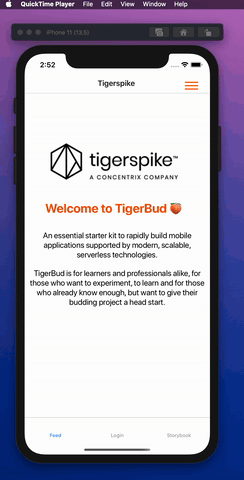
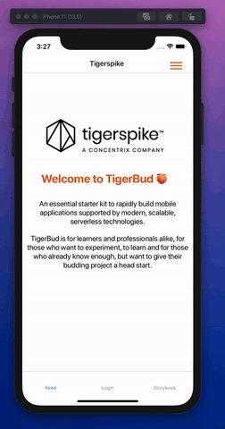

# TigerBud 🍑 React Native Application

This is the ReactNative application for "TigerBud 🍑".

## Table of Content

- [Screen](#Screen)
- [Technologies](#Technologies)
- [Deploy the API and authentication](#Deploy-the-API-and-authentication)
- [Spinning Up TigerBud Video](#Spinning-Up-TigerBud-Video)
- [Create AWS credentials](#Create-AWS-credentials)
- [Installation](#Installation)
  - [Clone the Repository and Initialise Amplify Project](#Clone-the-Repository-and-Initialise-Amplify-Project)
  - [Lauch the local AppSync & DynamoDb emulators](#Lauch-the-local-AppSync-&-DynamoDb-emulators)
  - [Run App](#Run-App)
  - [Simulate for iOS](#Simulate-for-iOS)
    - [Install pods](#Install-pods)
  - [Simulate for Android](#Simulate-for-Android)
  - [ESLint](#ESLint)
  - [Run StoryBook](#Run-StoryBook)
    - [Running the storybook in the simulator and devices](#Running-the-storybook-in-the-simulator-and-devices)
  - [Reactotron debugger](#Reactotron-debugger)
  - [Running the tests](#Running-the-tests)
- [UI Components Documentation](#UI-Components-Documentation)
- [Compatibility Versions](#Compatibility-Versions)
- [About the creators](#about-the-creators)
- [Contributors](#Contributors)

## Screens





## Technologies

Technologies used in Native Starter Kit

- [React Native](https://github.com/facebook/react-native)
  - React Native helps in making the development work easier and allowing the developers to focus on the core app features in every new release. It is the fastest-developing mobile app development that essentially permits you to create an isolated product with often outcomes.
- [AWS Amplify](https://docs.amplify.aws/start/q/integration/react-native)

  - AWS Amplify is a development platform for building secure, scalable mobile and web applications.
    Amplify covers the complete mobile application development workflow from version control, code testing, to production deployment, and it easily scales with your business from thousands of users to tens of millions.

- [NativeBase](https://nativebase.io/)
  - NativeBase is a free and open source framework for UI COmponents.
- [React Navigation](https://reactnavigation.org/)
  - React Navigation is a routing package that allows you to:
  - Declare different kinds of Routers.
  - Routers fall into the category of StackNavigator , DrawerNavigator , and TabNavigator.
  - We can also nest these Routers for more complex transitions.

## Deploy the API and authentication

The API and authentication are pre-defined in the `amplify/backend` configuration directory and can be deployed by following these steps:

Ensure you have valid AWS credentials in `~/aws/credentials` for the target AWS account. See (URL TO AWS USER HERE)

## Spinning Up TigerBud Video

[](https://youtu.be/vTbFhDH3OIs 'TigerBut Setup')

Install AWS Amplify CLI globaly

```bash
yarn add aws-amplify -g
```

## Create AWS credentials

Follow the instructions to create [AWS credentials](./create-iam-user.md).

## Installation

### Clone the Repository and Initialise Amplify Project

```bash
amplify init --app git@github.com:tigerspike/tigerbud-starter.git
```

Follow the steps in the console to set up.

### Lauch the local AppSync & DynamoDb emulators

```bash
amplify mock
```

## Run App

In the frontend directory, make sure you have installed dependencies by running:

```bash
yarn install
```

### Simulate for iOS

To install pod dependencies you may need to run the following command in the /ios folder
In your terminal go to folder ios

#### Install pods

```bash
pod install
```

```bash
cd ios
```

To run IOS run this command and it will be done for you.

```bash
yarn ios
```

### Simulate for Android

To run Android open Android Studio and hit the Run. Alternatively you can run this command and it will be done for you.

- Make sure you have an Android emulator installed and running.
- Run the following command in your terminal

```bash
yarn android
```

### ESLint

We use eslint to check the quality of the code base. To lint the source code, you can use the command below.

```bash
yarn lint
```

To fixed code:

```bash
lint --fix
```

### Run StoryBook

```bash
yarn storybook
```

### Running the storybook in the simulator and devices

App/src/config/config.js => flag 'storybook' to true

restart the bundler and storybook will run

[See Storybook documentation](./react-native/tools/storybook.md)

### Reactotron debugger

Reactotron is a standalone desktop app that helps with debugging the app.
Simply run the app and reacatron together and these features are available:

- toggle between storybook and app
- overlay designs over app for greater design accuracy
- api and network stack
- store/state tracking

[See Reactotron documentation](./react-native/tools/reactotron.md)

Alternatively, by running 'Reactotron' with the simulator you can easily toggle
between the app and storybook but clicking on 'Custom Commands' -> 'storybook'

### Running the tests

[See Jest documentation](./react-native/tools/jest.md)

#### Unit Tests

```bash
yarn test
```

## UI Components Documentation

The UI components used in Tigerbud are built on the [NativeBase UI library](https://nativebase.io/). NativeBase is a free and open source UI component library for React Native to build native mobile apps for iOS and Android platforms.
The Components are constructed in pure [React Native](https://github.com/facebook/react-native) platform along with some JavaScript functionality with rich set of customisable properties.

### [Follow UI Components Documentation](./react-native/ui/index.md)

## Compatibility Versions

... WIP ...

## About the creators

... WIP ...

## Contributors

This project exists thanks to all the people who contribute. ....

<!-- TODO fix below link -->

## [How to become contributor](./contributions.md)
